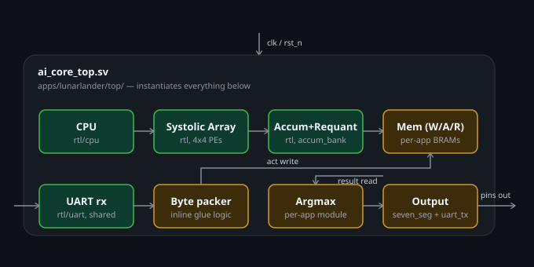
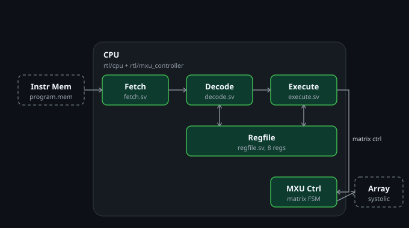

# AI Core


A heterogeneous AI accelerator built from scratch on a Basys 3 (Artix-7 XC7A35T). A small custom CPU drives a 4x4 weight-stationary systolic array and the whole thing is programmed through a 10-instruction ISA with its own assembler. Everything runs in INT8 end to end on the board and it's checked bit-for-bit against a NumPy reference model.

Two workloads run on the same core - 

- MNIST digit classification, which was the proof of concept
- LunarLander-v3, a PPO policy was trained, quantized to INT8 and playing the game live on the board

---

## Demo

[](https://youtu.be/VIDEO_ID_TBD)

*(click to play, hosted on YouTube)*

---

## What it is

A full custom inference stack:

1. ISA + assembler - A 32-bit instruction set for driving the matrix unit plus a two-pass Python assembler that gives `.mem` files
2. Scalar CPU - A 3-stage fetch/decode/execute sequencer with 8 registers. It isn't a general-purpose core, it's really just a controller for the matrix unit
3. 4x4 systolic array - Weight-stationary INT8 PEs mapped onto DSP slices with INT32 accumulation and then fixed-point requant + ReLU
4. Toolchain - Shared Python script that turns layer shapes into assembly and quantized weights into BRAM init files
5. Two apps - MNIST and LunarLander, each a per-app wrapper around the shared core

---

## Architecture

### Instantiation hierarchy

`ai_core_top` is the per-app wrapper. Everything in `rtl/` (teal) is shared and identical across both apps. The per-app items (amber) is the memories, the byte-packer,  argmax and the output stage all under `apps/<app>/`.



### CPU internals

3-stage pipeline with the register file and the matrix-unit controller. The CPU freezes its PC while the array runs: `stall = (is_m_op && !matrix_done) || is_halt`.



### Assembler toolchain

The `assembler/` folder is at the repo root. Layer shapes and quantized weights go in as inputs, `program.mem` and `weights.mem` come out and initialize the BRAMs.



### End-to-end flow - MNIST

Host sends a test image over UART, the board runs inference and the predicted digit shows up on the 7-segment display.



### End-to-end flow, LunarLander

The host streams observations to the board, the board sends the chosen action back over `uart_tx` and the host steps the environment and repeats.



---

## Results

| | MNIST | LunarLander |
|---|---|---|
| Network | 784 -> 128 -> 10 dense | 8 -> 128 -> 128 -> 4 dense  |
| Quantization | INT8 per-tensor | INT8 per-channel weights |
| Task metric | bit-exact vs golden (20/20 test images) | mean reward 261.2 over 20 ep (threshold 200 = solved) |
| On-board | live, UART image input | live, UART obs in / action out |

### Resource use (post-synthesis, `ai_core_top`, Artix-7)

| Resource | MNIST | LunarLander | Available |
|---|---|---|---|
| Slice LUTs | 1574 (7.57%) | 733 (3.52%) | 20,800 |
| Slice registers (FF) | 1193 (2.87%) | 1171 (2.81%) | 41,600 |
| Block RAM (36k tiles) | 32.5 (65%) | 8.5 (17%) | 50 |
| DSP48E1 | 16 (17.78%) | 24 (26.67%) | 90 |
| Clock | 100 MHz | 100 MHz | |
| Setup slack (WNS) | +0.035 ns | +0.253 ns | |

---

## ISA

32-bit fixed-width encoding:

```
[31:26] opcode (6b) | [25:21] Rd (5b) | [20:16] Rs1 (5b) | [15:0] immediate (16b)
```

| Op | Mnemonic | Operands | Action |
|---|---|---|---|
| 0x00 | `LI` | Rd, Imm | Rd <- Imm |
| 0x01 | `ADDI` | Rd, Rs1, Imm | Rd <- Rs1 + Imm |
| 0x02 | `LOOP` | Rs1, Imm | Rs1 <- Rs1 - 1, branch to Imm if Rs1 != 0 |
| 0x03 | `M_LD_W` | Rs1 | load weight tile into array |
| 0x04 | `M_MUL` | Rd, Rs1 | run systolic matmul |
| 0x05 | `ACT` | Rs1 | ReLU activation |
| 0x06 | `STATUS` | Rd | Rd <- matrix-unit status |
| 0x07 | `HALT` | — | stop |
| 0x08 | `M_LD_A` | Rs1 | load activation tile |
| 0x09 | `M_ST` | Rs1 | store accumulator result |

Registers are `R0` through `R7`. Labels for `LOOP` targets get resolved in a two-pass scan.

---

## Repo layout

```
ai-core/
├── rtl/                     # shared core identical across apps
│   ├── cpu/                 # fetch, decode, execute, regfile
│   ├── pe/                  # INT8 processing element (DSP slice)
│   ├── systolic_array/      # 4x4 weight-stationary array
│   ├── skew_buffer/         # input skew
│   ├── deskew_buffer/       # output de-skew
│   ├── mxu_controller/      # matrix-unit FSM
│   ├── mxu_integration/     # array + controller wiring
│   ├── accum_bank/          # INT32 accumulators
│   ├── requant/             # fixed-point ReLU + rescale
│   └── uart/                # uart_rx, uart_tx
├── assembler/               # shared toolchain
│   ├── assembler.py         # two-pass assembler -> .mem
│   ├── build_program.py     # interactive: layer pairs -> asm -> .mem
│   ├── convert_weights.py   # quantized .npy weights -> weights.mem
│   └── layer_gen.py         # layer-shape -> assembly codegen
├── apps/
│   ├── mnist/
│   │   ├── top/             # ai_core_top.sv, W/A/R mem, mnist.asm, program.mem
│   │   ├── argmax/          # 10-way streamed argmax
│   │   ├── seven_seg/
│   │   ├── golden_model/    # train_quantize.py, golden.py, w*.npy, b*.npy, test data
│   │   ├── mnist_img_host/  # send_image.py (host sender)
│   │   ├── sim/             # cocotb testbench
│   │   ├── constrs_1/       # XDC constraints
│   │   └── build.tcl
│   └── lunarlander/
│       ├── top/             # ai_core_top.sv (3-layer, byte-packer), program.asm
│       ├── argmax/          # 4-way Q16 dequant comparator
│       ├── seven_seg/
│       ├── golden_model/    # train_quantize.py (PPO), golden.py, w*.npy, scales.json
│       ├── lunarlander_host/ # host_script.py (drives the board + render window)
│       ├── sim/
│       ├── constrs_1/
│       └── build.tcl
├── LICENSE
└── README.md
```

---

## Quickstart

Setup is split across two folders: `~/ai_core` on WSL for cocotb / Verilator / Python and `C:\ai_core_vivado` on Windows for Vivado. Files get copied between them.

### 1. Generate the memory files (WSL)

Program first then weights.

MNIST:
```bash
# program.mem - assemble the hand-written program
python assembler/assembler.py apps/mnist/top/mnist.asm apps/mnist/top/program.mem

# weights.mem - trained INT8 weights (.npy from golden_model) -> BRAM 
python assembler/convert_weights.py 784,128;128,10 \
    apps/mnist/golden_model/w1.npy apps/mnist/golden_model/w2.npy \
    -o apps/mnist/top/weights.mem
```

LunarLander (layer pairs carry bias row, so 8+1 and 128+1):
```bash
python assembler/assembler.py apps/lunarlander/top/program.asm apps/lunarlander/top/program.mem

python assembler/convert_weights.py 9,128;129,128;129,4 \
    apps/lunarlander/golden_model/w1.npy apps/lunarlander/golden_model/w2.npy apps/lunarlander/golden_model/w3.npy \
    -o apps/lunarlander/top/weights.mem
```

If you don't want to hand-write the `.asm`, `python assembler/build_program.py` takes the layer `(in,out)` pairs and does the codegen + assembly in one go. The `.npy` weights come out of each app's `golden_model/train_quantize.py`.

### 2. Simulate (WSL)

```bash
cd apps/mnist/sim && make          # MNIST
cd apps/lunarlander/sim && make    # LunarLander
```

### 3. Build the bitstream (Windows -> Vivado)

```powershell
vivado -mode batch -source apps/mnist/build.tcl
vivado -mode batch -source apps/lunarlander/build.tcl
```

Runs fine from PowerShell or cmd as long as `vivado` is on your PATH. If it isn't, use the Vivado Tcl Shell

### 4. Run it on hardware (Windows)

Serial only works on the Windows side. Port and baud are hardcoded in the host scripts (`COM4`, 115200) so change those if it differ.

```powershell
# MNIST - send a test image over serial
python apps/mnist/mnist_img_host/send_image.py

# LunarLander - live loop with a render window
python apps/lunarlander/lunarlander_host/host_script.py
```
